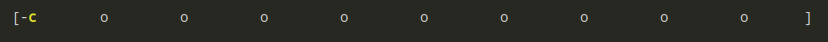

# ink-progress-bar-pacman

Progress bar pacman style



## Install

```sh
yarn add ink-progress-bar-pacman
```

## Usage

```tsx
import React from 'react'
import { render } from 'ink'
import ProgressBarPacman from 'ink-progress-bar-pacman'

const App = () => {
  const [current, setCurrent] = useState(0)

  useEffect(() => {
    const interval = setInterval(() => {
      setCurrent(current => {
        if (current > process.stdout.columns)
          clearInterval(interval)

        return current + 1
      })
    }, 100)

    return () => {
      clearInterval(interval)
    }
  }, [])

  return <ProgressBarPacman
    width={process.stdout.columns}
    percent={current / process.stdout.columns}
  />
}

render(<App />)
```
